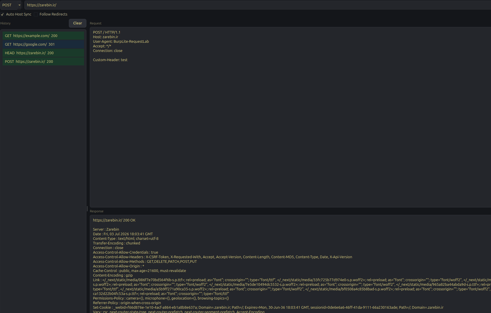
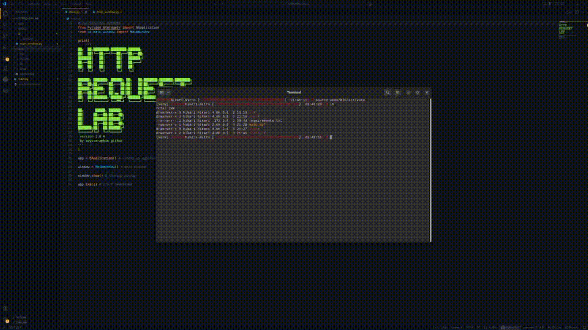

# HttpRequestLab

A small, fast desktop tool for crafting, sending, and inspecting raw HTTP requests — built as a lightweight "Burp-lite" companion for manual testing and quick request tampering.

<p align="center">
  
</p>

<!-- Optional: replace with an actual demo GIF -->
<p align="center">
  
</p>

> **Status:** early-stage side project. It's intentionally minimal right now — built to solve one problem well (send a request, see the raw response) rather than to be a full proxy/interceptor. Expect rough edges; contributions and issues are welcome.

---

## Why

Most HTTP clients (Postman, Insomnia, browser dev tools) are built for "normal" API testing — they normalize headers, auto-fix things, and get in the way when you actually want to send a malformed, non-standard, or hand-crafted request during a pentest. HttpRequestLab gives you a raw request editor instead: you write the request line, headers, and body exactly as you want them, and it goes out on the wire (almost) as-is.

## Features

- **Raw request editor** — edit the request line, headers, and body as plain text, not a form
- **Method switcher** — GET / POST / PUT / PATCH / HEAD / DELETE, auto-syncs the request line
- **Auto Host-header sync** — keeps the `Host` header aligned with the URL you're targeting (toggleable)
- **Redirect control** — follow or block redirects per-request
- **Response viewer** — status line, headers, body, and response time in one panel
- **Request history** — every sent request is logged with method, URL, and status; color-coded by status range (2xx/3xx/4xx/5xx); click to reload a past request back into the editor
- **Hover tooltips** on history items — path, status, size, and timing at a glance

## Architecture

The project follows a simple **UI / Core separation** so the request logic stays testable and independent of the GUI:

```
┌─────────────────────────────┐
│           ui/                │   PySide6 (Qt) widgets, layout, styling
│      main_window.py          │   — owns all user interaction & rendering
└───────────────┬──────────────┘
                │ calls
                ▼
┌─────────────────────────────┐
│           core/              │   Pure logic, no Qt dependency
│  ┌─────────────────────┐    │
│  │ request_builder.py   │    │   builds a raw HTTP request template from method+URL
│  │ request_parser.py    │    │   parses raw text back into method/path/headers/body
│  │ http_client.py        │    │   sends the parsed request via `requests`, keeps
│  │                       │    │   the URL and Host header in sync
│  │ history_data.py       │    │   in-memory list of past requests/responses
│  └─────────────────────┘    │
└─────────────────────────────┘
```

- **`ui/`** never talks to the network directly — it only calls into `core/`.
- **`core/`** never touches Qt — it's plain Python, which makes it straightforward to unit test or reuse in a CLI later.
- State (history) is currently kept in memory only (`history_data.HISTORY`), reset on restart.

## Flow

1. User types/selects a **method** and a **URL**, hits **Send**.
2. On first send, `request_builder` generates a raw request template (request line + default headers) into the editor.
3. If **Auto Host Sync** is on, the `Host` header is rewritten to match the current URL before sending.
4. The raw text in the editor is handed to `request_parser`, which splits it into method, path, headers, and body.
5. `http_client` fires the actual request with `requests`, using the parsed headers/body (so anything you typed in the editor — including edits — is what actually gets sent).
6. The response (status, headers, body, timing) is rendered in the response panel.
7. The request + result is appended to `history_data.HISTORY` and shown in the sidebar, color-coded by status code, with a hover tooltip for quick details.
8. Clicking any history item reloads that exact raw request back into the editor so you can tweak and resend it.

## Tech Stack

| Layer      | Tool                          |
|------------|--------------------------------|
| GUI        | [PySide6](https://doc.qt.io/qtforpython/) (Qt for Python) |
| HTTP       | [`requests`](https://docs.python-requests.org/)            |
| Language   | Python 3.12                    |

## Installation

### It's recommended to use a virtual environment instead of installing packages into your system Python.
```bash
git clone https://github.com/abysseraphim/HttpRequestLab.git
cd HttpRequestLab
pip install -r requirements.txt
python3 main.py
```

## Build Executable

Using PyInstaller:

```bash
pip install pyinstaller

pyinstaller \
  --onefile \
  --windowed \
  main.py
```

## Project Structure
```
HttpRequestLab/
├── main.py                  # entry point
├── requirements.txt
├── statics/
│   └── UI.png
├── ui/
│   └── main_window.py       # Qt window, layout, event wiring
└── core/
    ├── request_builder.py   # raw request template generator
    ├── request_parser.py    # raw text -> structured request
    ├── http_client.py       # sends requests, keeps Host header in sync
    └── history_data.py      # in-memory request history
```

## Roadmap

Things that aren't in yet, on the "maybe later" list:

- [ ] Persistent history (SQLite/JSON instead of in-memory)
- [ ] Request/response diffing between history entries
- [ ] Proxy support (route through Burp/mitmproxy)
- [ ] Repeater-style multi-tab editing
- [ ] Syntax highlighting in the raw editor

## Disclaimer

This tool is built for **authorized security testing and educational purposes**.

## Author

**abysseraphim** — [github.com/abysseraphim](https://github.com/abysseraphim)
